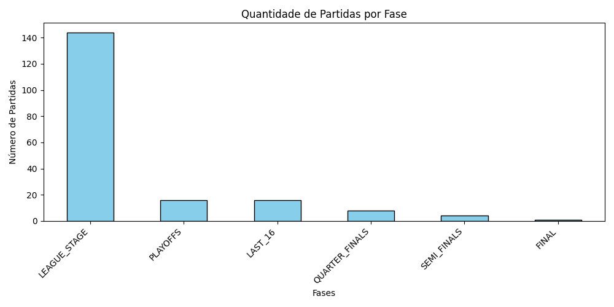
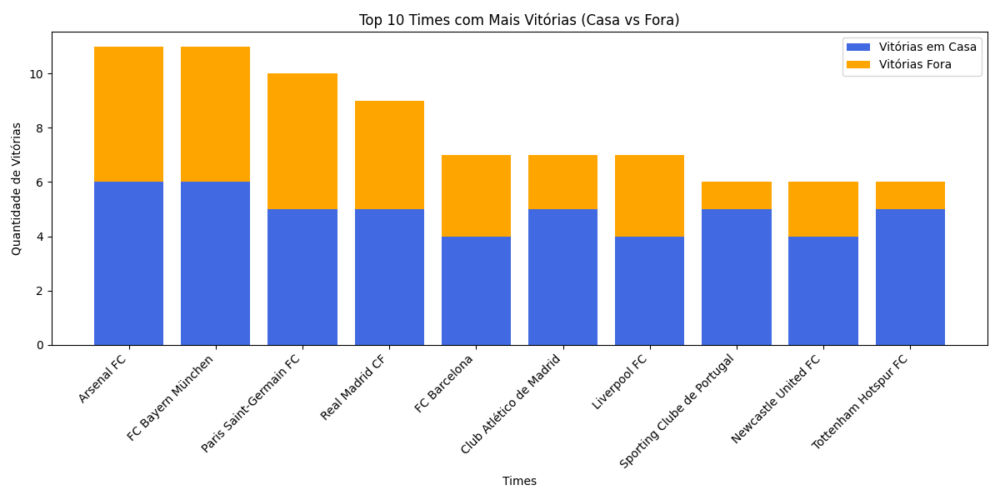
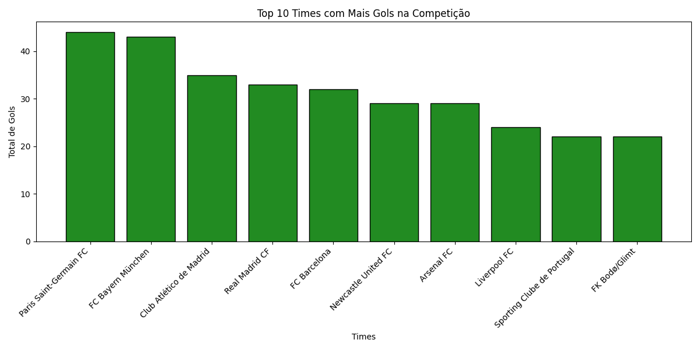

# ⚽ Pipeline Simples de Análise de Dados - Campeonato de Futebol

Projeto de análise de dados utilizando **Python, Pandas e PyArrow**, com objetivo de construir uma pipeline simples de dados passando pelas etapas de processamento, transformação, criação de indicadores e geração de análises.

O projeto simula uma estrutura próxima de um ambiente real de dados, organizando os dados em camadas e gerando arquivos analíticos em formato **Parquet**, além de gráficos para visualização dos resultados.

---

# 🚀 Objetivo do Projeto

Construir uma pipeline simples capaz de:

- Ler dados processados em formato Parquet
- Transformar dados utilizando Pandas
- Criar KPIs esportivos
- Realizar análises de desempenho dos times
- Gerar tabelas analíticas
- Exportar resultados em Parquet
- Criar gráficos utilizando Matplotlib

---

# 🏗️ Estrutura do Projeto

```text
Projeto/
│
├── data/
│   │
│   ├── processed/
│   │   ├── ano_da_competicao.parquet
│   │   ├── competicao.parquet
│   │   ├── partidas.parquet
│   │   ├── partidas_info.parquet
│   │   ├── resultados_partida.parquet
│   │   ├── resumo_competicao.parquet
│   │   └── times.parquet
│   │
│   └── analitics/
│       │
│       ├── analytics_times.parquet
│       ├── tabela_partidas.parquet
│       ├── tabela_gols.parquet
│       ├── kpis_gerais.parquet
│       ├── casa_vs_fora.parquet
│       ├── jogos_com_mais_gols.parquet
│       │
│       └── images/
│           ├── grafico_partidas_por_fase.png
│           ├── grafico_top_10_vitorias.png
│           └── grafico_top_10_gols.png
│
└── src/
    └── analise.py
```

---

# 🔄 Fluxo da Pipeline

```text
Dados Processados
        |
        ↓
Leitura dos arquivos Parquet
(PyArrow)
        |
        ↓
Transformação e análise
(Pandas)
        |
        ↓
Criação dos KPIs
        |
        ↓
Exportação da camada Analytics
(Parquet)
        |
        ↓
Geração de gráficos
(Matplotlib)
```

---

# 🛠️ Tecnologias Utilizadas

## Python

Linguagem principal utilizada para construção da pipeline.

---

## Pandas

Utilizado para:

- Tratamento dos dados
- Aplicação de filtros
- Agrupamentos
- Cálculos estatísticos
- Criação dos indicadores

---

## PyArrow

Utilizado para:

- Leitura dos arquivos Parquet
- Conversão entre Arrow Table e DataFrame
- Escrita dos arquivos analíticos

---

## Matplotlib

Utilizado para criação dos gráficos e visualização dos resultados.

---

# 📊 Análises Realizadas

## Quantidade de partidas por fase

Foi analisada a quantidade de partidas em cada fase da competição.



---

# 🏆 Times com mais vitórias

Foi criado um ranking dos times com maior número de vitórias considerando:

- Vitórias dentro de casa
- Vitórias fora de casa
- Total de vitórias



---

# ⚽ Times com mais gols

Análise dos times que tiveram maior quantidade de gols marcados durante a competição.



---

# 📈 KPIs Gerados

A pipeline calcula indicadores como:

- Média de gols por partida
- Total de gols da competição
- Número de empates
- Jogos decididos nos pênaltis
- Times com mais vitórias
- Times com mais gols
- Desempenho casa vs fora

---

# 🏠 Análise Casa vs Fora

Foi criada uma análise comparando o desempenho dos times como mandante e visitante.

Indicadores:

- Quantidade de partidas em casa
- Quantidade de partidas fora
- Média de gols em casa
- Média de gols fora

Arquivo gerado:

```text
casa_vs_fora.parquet
```

---

# 📦 Arquivos Analíticos Gerados

A camada analytics gera:

```text
analytics_times.parquet

tabela_partidas.parquet

tabela_gols.parquet

kpis_gerais.parquet

casa_vs_fora.parquet

jogos_com_mais_gols.parquet
```

---

# 💡 Conceitos Praticados

Durante o desenvolvimento foram aplicados conceitos de:

- Organização de dados em camadas
- Manipulação de arquivos Parquet
- Processamento com Pandas
- Transformação de dados
- Criação de KPIs
- Agregações e agrupamentos
- Exportação de tabelas analíticas
- Visualização de dados

---

# 🔮 Próximos Passos

Possíveis melhorias futuras:

- Inserir banco de dados PostgreSQL
- Criar um processo ETL completo
- Automatizar execução da pipeline
- Adicionar logs
- Utilizar Docker
- Orquestrar processos com Airflow
- Criar dashboards interativos

---

# 👨‍💻 Autor

Projeto desenvolvido como parte da evolução em **Engenharia de Dados utilizando Python e ferramentas do ecossistema de dados**.